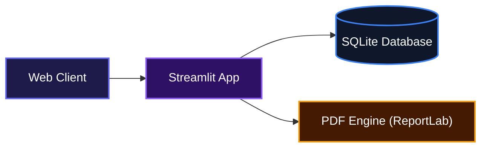
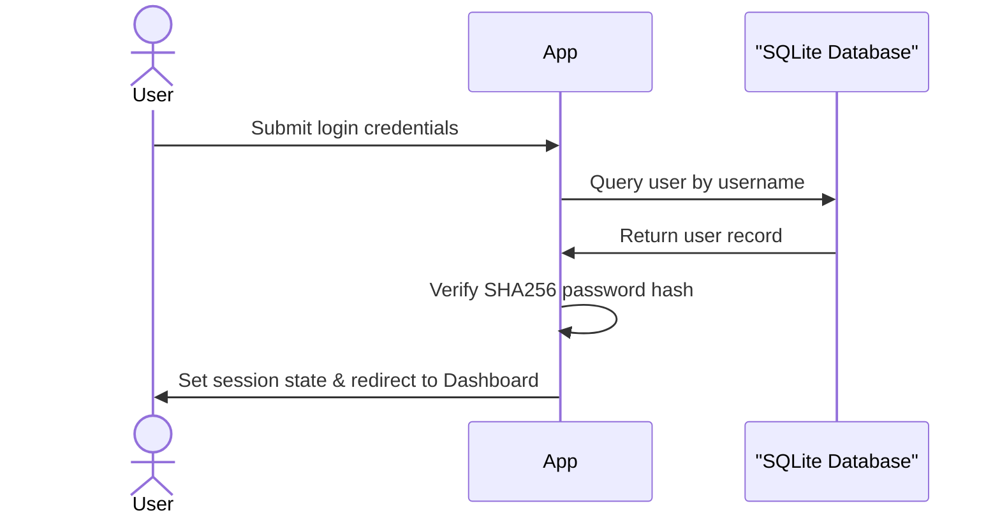
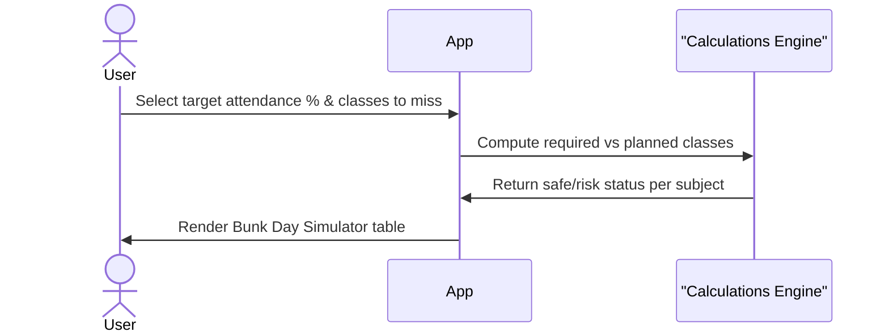

# 🎓 THRESHOLD: VTU Academic Tracker

A sleek, dark-themed academic tracker built for BMSCE/VTU students.  
Track marks, attendance, predict grades, manage bunks, and monitor SGPA/CGPA, all in one place.

## System Architecture



---

## ✨ Features

| Feature | Description |
|---|---|
| 📊 **Marks Tracker** | Enter CIE, Quiz, AAT, Lab scores and get real-time internal marks out of 50 |
| 🎯 **Grade Predictor** | See exactly what SEE score you need for O / A+ / A / B+ / B / C |
| 📅 **Attendance Manager** | Track per-subject attendance with bunk budgets |
| 🚫 **Bunk Planner** | Smart cross-subject bunk planning + day simulator |
| 📈 **SGPA / CGPA** | Calculate current SGPA, track past semesters, run what-if scenarios |
| 📅 **Academic Calendar** | Full BMSCE Even Semester 2025-26 schedule with live countdowns (IST) |
| 👤 **Profile** | Name, department, current semester, photo |
| **Analytics Dashboard** | Visual breakdown of academic performance using Plotly (SGPA trend, grade radar, attendance pie charts) |
| **Export Reports** | Download full academic data as a generated PDF report or CSV summaries |
| **Local Authentication** | Built-in offline authentication protecting user sessions and data |
| **Customization** | Native dark and light mode theme toggles |

### Authentication Flow


### Bunk Simulator Flow


---

## 🗂️ Project Structure

```text
threshold/
├── app.py                  # Main entry point (Auth & Routing)
├── requirements.txt
├── README.md
├── utils/
│   ├── auth.py             # SQLite authentication
│   ├── calculations.py     # Grade/marks/attendance math
│   ├── calendar_data.py    # BMSCE academic calendar data
│   ├── charts.py           # Plotly chart generation
│   ├── database.py         # SQLite DB operations
│   ├── export.py           # PDF and CSV generation
│   └── styles.py           # Global CSS (Dark/Light)
└── pages/
    ├── analytics_page.py   # Visual charts
    ├── bunk_page.py        # Bunk planner
    ├── calendar_page.py    # Calendar view
    ├── dashboard.py        # Home dashboard
    ├── export_page.py      # Data export views
    ├── profile_page.py     # User settings
    ├── sgpa_page.py        # SGPA / CGPA tracker
    └── subject_detail.py   # Subject marks & attendance detail
```

---

## 🚀 Getting Started

### Run locally

```bash
git clone https://github.com/Anas2694/College-Threshold.git
cd College-Threshold
pip install -r requirements.txt
streamlit run app.py
```

### Run on Google Colab

```python
# Cell 1
!pip install streamlit pyngrok pandas numpy plotly reportlab Pillow -q

# Cell 2: upload your files or clone from GitHub
!git clone https://github.com/Anas2694/College-Threshold.git
%cd College-Threshold

# Cell 3
!streamlit run app.py --server.port=8501 --server.headless=true &

# Cell 4
import time; time.sleep(10)
from pyngrok import ngrok
ngrok.set_auth_token("YOUR_NGROK_TOKEN")
url = ngrok.connect(8501, proto="http")
print("🚀 Live at:", url.public_url)
```

---

## 🏫 College

Built for **B.M.S. College of Engineering, Bengaluru-19**  
Autonomous Institute, Affiliated to VTU

---

## ⚠️ Disclaimer

This is a personal academic tool for educational purposes.  
Grade calculations follow BMSCE's internal assessment scheme: verify with your institution.

---

## 📄 License

No license file is currently included. Unless a license is added, the repository's source remains under the author's default copyright.

[](https://dokugen.samueltuoyo.com)
